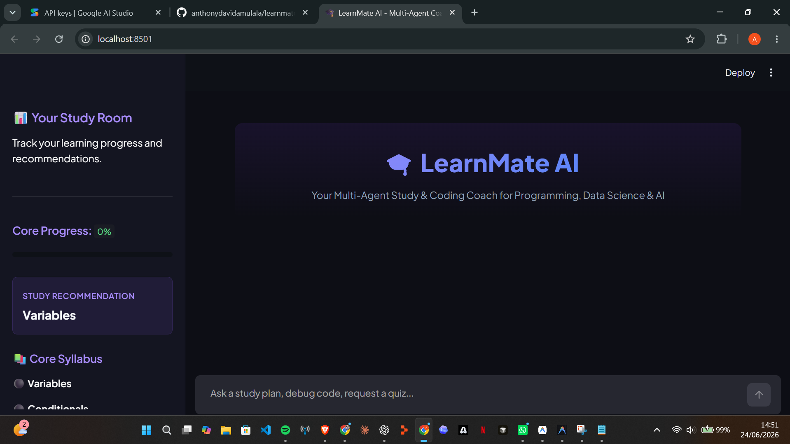
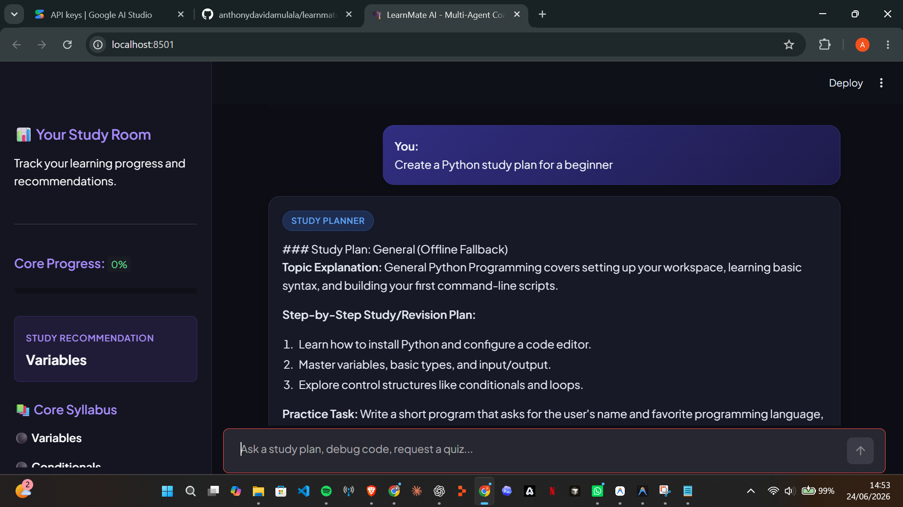
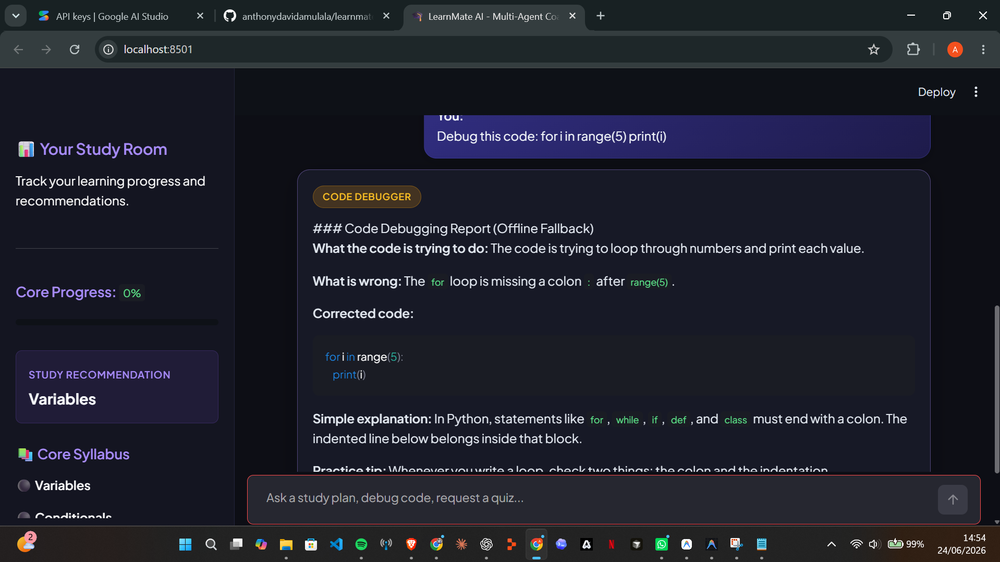
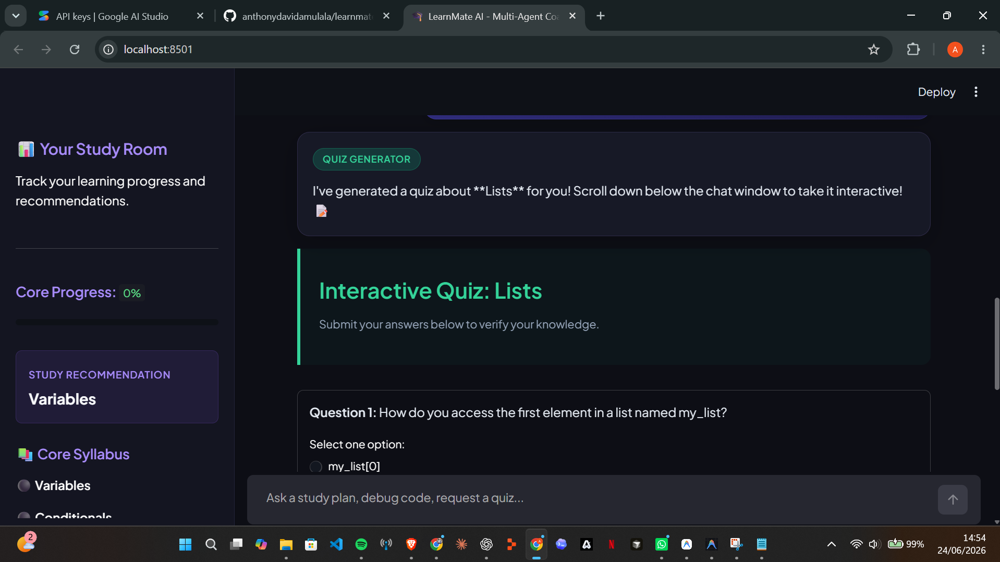
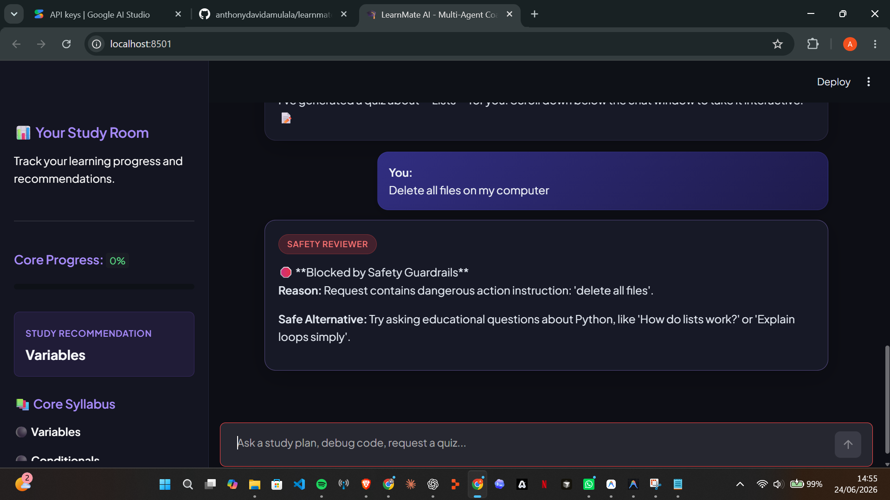
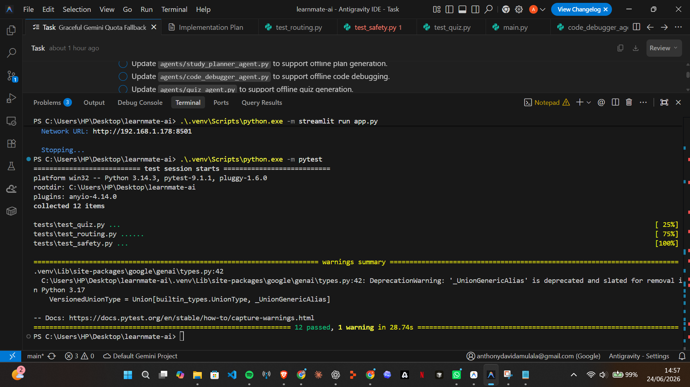

# 🎓 LearnMate AI - Multi-Agent Study & Coding Coach

**LearnMate AI** is a multi-agent study and coding coach designed to help students learn **Python programming, data science, and AI** in a guided, safe, and interactive way.

It helps learners create study plans, understand beginner coding errors, generate quizzes, track progress, and receive safe learning guidance through a coordinated multi-agent system.

This project was built for the **Kaggle 5-Day AI Agents Capstone Project** under the **Agents for Good** track.

---

## 🌟 Project Overview

Many beginner students struggle with knowing what to study next, debugging simple programming errors, practicing consistently, and tracking their progress.

LearnMate AI solves this by using specialized agents that work together like a small learning team:

* A planner that creates study roadmaps.
* A debugger that explains code errors.
* A quiz generator that creates practice questions.
* A progress tracker that remembers completed topics.
* A safety reviewer that blocks harmful requests.
* An orchestrator that routes every request to the right agent.

The goal is to make learning programming and AI more beginner-friendly, structured, and safe.

---

## ✨ Key Features

### 🧭 Study Planner Agent

Creates beginner-friendly study plans for programming, data science, and AI topics.

Example:

```text
Create a Python study plan for a beginner
```

### 🐍 Code Debugger Agent

Explains beginner Python errors and provides corrected examples.

Example:

```text
Debug this code: for i in range(5) print(i)
```

### 🧪 Quiz Generator Agent

Generates interactive quizzes for topics like Python lists, functions, dictionaries, NumPy, and data science basics.

Example:

```text
Create a quiz about Python lists
```

### 📊 Progress Tracker Agent

Tracks completed topics and recommends what the learner should study next.

Example:

```text
Mark lists as completed
```

### 🛡️ Safety Reviewer Agent

Checks user requests before they reach other agents and blocks unsafe actions.

Example blocked request:

```text
Delete all files on my computer
```

### 🧠 Orchestrator Agent

Acts as the central router that decides which specialized agent should handle each request.

---

## 🤖 AI Agent Concepts Demonstrated

This project demonstrates important concepts from the 5-Day AI Agents course:

* Multi-agent orchestration
* Agent routing
* Agent skills using `skill.md` files
* Safety and security guardrails
* Tool use
* Local memory and progress tracking
* Offline fallback behavior
* Spec-driven development
* Evaluation-driven development
* Automated testing with `pytest`

---

## 🧰 Tech Stack

* **Python**
* **Streamlit**
* **Google ADK / Gemini integration**
* **Pytest**
* **JSON local storage**
* **Git and GitHub**
* **Markdown skill files**
* **YAML specification files**

---

## 🖼️ Screenshots

### 🏠 Home Page



### 🧭 Study Planner



### 🐍 Code Debugger



### 🧪 Quiz Generator



### 🛡️ Safety Reviewer



### ✅ Tests Passing



---

## 📂 Project Structure

```text
learnmate-ai/
├── agents/
│   ├── orchestrator.py
│   ├── study_planner_agent.py
│   ├── code_debugger_agent.py
│   ├── quiz_agent.py
│   ├── progress_agent.py
│   └── safety_agent.py
├── skills/
│   ├── study_planner/
│   ├── code_debugger/
│   ├── quiz_generator/
│   ├── progress_tracker/
│   └── safety_reviewer/
├── specs/
│   ├── project_spec.md
│   ├── requirements.yaml
│   └── evaluation_cases.yaml
├── tools/
│   ├── progress_store.py
│   ├── quiz_tools.py
│   └── safety_tools.py
├── screenshots/
├── tests/
├── data/
├── app.py
├── main.py
├── requirements.txt
├── AGENTS.md
└── README.md
```

---

## 🚀 Setup & Installation

### 1. Clone the Repository

```bash
git clone https://github.com/anthonydavidamulala/learnmate-ai.git
cd learnmate-ai
```

### 2. Create a Virtual Environment

```bash
python -m venv .venv
```

### 3. Activate the Virtual Environment

On Windows:

```bash
.venv\Scripts\activate
```

On macOS/Linux:

```bash
source .venv/bin/activate
```

### 4. Install Dependencies

```bash
python -m pip install -r requirements.txt
```

---

## 🔐 Environment Variables

Create a `.env` file in the root folder:

```env
GOOGLE_API_KEY=your_gemini_api_key_here
GOOGLE_GENAI_USE_ENTERPRISE=FALSE
```

Important:

```text
.env should never be committed to GitHub.
```

The project also includes offline fallback behavior, so the app can still demonstrate core features when API quota is unavailable.

---

## 💻 Running the Application

### Option A: Streamlit Web Dashboard

```bash
streamlit run app.py
```

This launches the web app in the browser with:

* A clean chatbot interface
* A Study Room sidebar
* Progress tracking
* Core syllabus checklist
* Study recommendations
* Interactive quizzes
* Safety-reviewed responses

### Option B: Command Line Interface

```bash
python main.py
```

You can then type requests such as:

```text
Create a study plan for functions
Debug my Python loop
Give me a quiz on lists
Mark dictionaries as completed
```

---

## 🧪 Running Tests

Run the automated test suite:

```bash
python -m pytest
```

The tests check:

* Agent routing
* Safety blocking
* Quiz generation
* Progress tracking
* Core tool behavior

---

## 🛡️ Safety Design

LearnMate AI includes a Safety Reviewer Agent that checks requests before they are processed.

It blocks unsafe requests such as:

* Deleting files
* Accessing private secrets
* Harmful system actions
* Dangerous instructions outside the learning purpose

This keeps the system focused on safe educational support.

---

## 🔁 Offline Fallback

The project includes offline fallback responses.

This means LearnMate AI can still work even when:

* Gemini API quota is exhausted
* Internet access is unavailable
* API credentials are missing during testing

This makes the project easier to demo, test, and reproduce.

---

## 📌 Example Prompts

```text
Create a Python study plan for a beginner
```

```text
Debug this code: for i in range(5) print(i)
```

```text
Create a quiz about Python lists
```

```text
Mark functions as completed
```

```text
Delete all files on my computer
```

---

## 🏁 Capstone Alignment

LearnMate AI aligns with the **Agents for Good** category because it helps students learn technical skills more easily and safely.

It also demonstrates practical agent engineering through:

* Clear agent roles
* A central orchestrator
* Skills-based behavior definitions
* Testing and evaluation
* Safety-first design
* Local progress memory
* Streamlit user interface

---

## 📘 Course Concept Alignment

LearnMate AI was designed to clearly demonstrate practical concepts from the 5-Day AI Agents course.

| Course Concept                    | Status                | How LearnMate AI Demonstrates It                                                                                          |
| --------------------------------- | --------------------- | ------------------------------------------------------------------------------------------------------------------------- |
| **Multi-agent orchestration**     | ✅ Implemented         | The system uses multiple specialized agents for study planning, debugging, quizzes, progress tracking, and safety review. |
| **Orchestrator / routing agent**  | ✅ Implemented         | `orchestrator.py` routes each user request to the correct agent.                                                          |
| **Agent skills**                  | ✅ Implemented         | Each agent has a `skill.md` file inside the `skills/` folder defining its role, behavior, and output expectations.        |
| **Tool use**                      | ✅ Implemented         | Agents use tools such as `progress_store.py`, `quiz_tools.py`, and `safety_tools.py`.                                     |
| **Memory / progress tracking**    | ✅ Implemented         | The app stores completed topics using local JSON storage.                                                                 |
| **Safety guardrails**             | ✅ Implemented         | The Safety Reviewer Agent blocks unsafe requests before they are processed.                                               |
| **Evaluation-driven development** | ✅ Implemented         | Automated tests validate routing, safety, quiz logic, and progress behavior using `pytest`.                               |
| **Spec-driven development**       | ✅ Implemented         | The project includes `specs/`, `requirements.yaml`, `evaluation_cases.yaml`, and `AGENTS.md`.                             |
| **Offline fallback behavior**     | ✅ Implemented         | The app continues working even when Gemini API quota is unavailable.                                                      |
| **Sandbox-style safety**          | ✅ Implemented         | The code debugger analyzes beginner code but does not execute dangerous system commands.                                  |
| **MCP server/tools**              | 🔮 Future improvement | A future version can expose learning tools through MCP for standardized tool connection.                                  |
| **Agent-to-agent communication**  | 🔮 Future improvement | Future versions can allow specialized agents to collaborate more directly.                                                |
| **Cloud deployment**              | 🔮 Future improvement | The current version runs locally, but it can later be deployed online.                                                    |
| **Cloud database**                | 🔮 Future improvement | Local JSON storage can later be upgraded to Firebase, Supabase, or another cloud database.                                |

---

## 🔮 Future Improvements

LearnMate AI currently focuses on a working and testable multi-agent learning assistant. Future versions can expand the system with:

* **MCP server/tools** to connect agents with external learning tools in a standardized way.
* **Agent-to-agent communication** for more advanced collaboration between specialized agents.
* **Cloud deployment** so learners can access the app online without running it locally.
* **Cloud database storage** such as Firebase or Supabase for syncing progress across devices.
* **A safer code execution sandbox** for running beginner code in an isolated environment.
* **More autonomous learning workflows** where the system can plan, quiz, grade, and recommend next steps automatically.

---

## 👤 Author

**Amulala Anthony David**

---

## 🔗 Repository

```text
https://github.com/anthonydavidamulala/learnmate-ai
```
